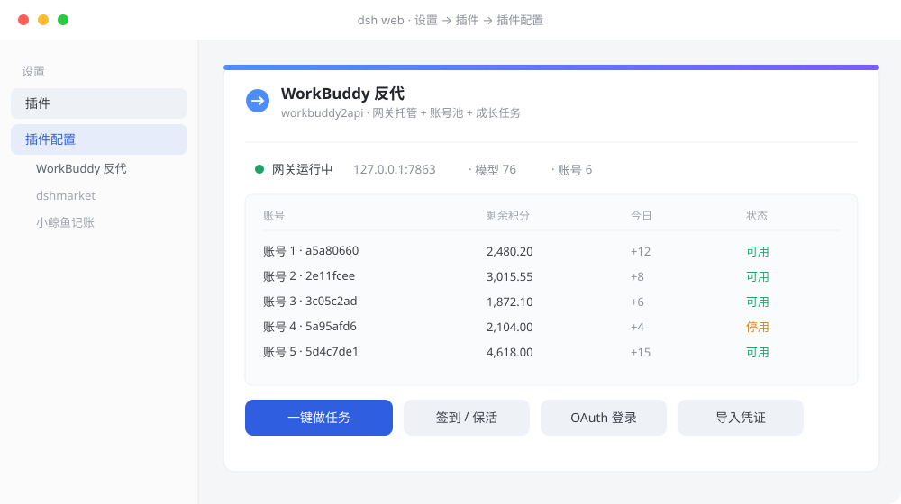

<p align="center">
  
</p>

# dsh-plugin-wb2api-ui

[English](README.en.md) | 中文

[](LICENSE)
[](package.json)

把本机 WorkBuddy / CodeBuddy 账号池接进 DeepSeek Harness —— 一个包三件事：**托管网关进程并注册模型 provider**、**Web 设置面板**、**成长任务自动化引擎**。

装一个插件 → 有模型服务、有面板、能一键做任务。网关二进制随包发布，装到哪都能跑。



## 你会得到

- **模型服务**——插件自己托管 `wb2a-server` 网关（拉起 / 探活 / 崩溃重启 / 随 dsh 退出回收），把它的模型目录注册成 dsh 的 LLM provider；dsh 里选模型即可用，不用另配服务
- **随包网关**——`backend/bin/wb2a-server.exe`（Windows amd64）跟着包走，定位顺序里包内那份优先级最高，`dsh plugin add` 装到哪个 profile 都能找到
- **设置面板**——dsh 设置里的「WorkBuddy 反代」分区：网关状态、每账号剩余积分、OAuth 登录、凭证导入、账号启停，一屏管完
- **一键做任务**——确认待办 → 两轮执行 → 达标自动领奖，全程在面板上看着跑
- **零第三方依赖**——网关托管、ZIP 解压、任务引擎全是纯 Node；不拉依赖树，不动构建链
- **凭证不出本机**——账号池只读本机运行目录，`accessToken` / `refreshToken` 与网关 `api_key` 永不入仓库

## 安装

五种装法任选其一。**装完必须重启 dsh** —— 宿主半侧只在启动时读 `bundles`。

### 一、桌面端 UI：添加插件（最省事）

设置 → 插件 → **添加插件**。输入框接受包名、Git 地址、压缩包、本地绝对路径四种形式 —— 除包名外都能直接用：

| 输入 | 示例 | 本插件 |
|---|---|---|
| GitHub 仓库地址 | `https://github.com/Wei894348/dsh-wb2api` | ✅ 已实测 |
| GitHub 简写（pnpm 规格） | `github:Wei894348/dsh-wb2api` | ✅ |
| 本地目录绝对路径 | `F:\project\dsh_chajian\dsh-wb2api` | ✅ |
| 压缩包路径 | `F:\...\dsh-plugin-wb2api-ui-1.5.2.tgz` | ✅ |
| npm 包名 | `dsh-plugin-wb2api-ui` | ⚠️ 尚未发布到 npm |

> 对话框里的引导写得很明确：**包名就是 npm 包名**，即社区插件 README 里 `dsh plugin add` 或
> `pnpm add` 之后那一段（如 `dsh-xxx`、`@作者/插件名`）。本插件还没发到 npm，所以那一行走不通 ——
> 走 GitHub 地址、本地目录或压缩包都可以。

**安装源**（对话框右上，默认「中国大陆镜像源」）选择**从哪个 npm 源拉包**：

| 选项 | 说明 |
|---|---|
| 默认安装源 | 跟随 pnpm 当前配置（`pnpm config get registry`） |
| npm 官方源 | `registry.npmjs.org` |
| 中国大陆镜像源 | npmmirror |
| 自定义地址 | 内网 / 私有源，须以 `http://` 或 `https://` 开头；要登录的源把凭据放进本机 `~/.npmrc` |

它**只对 npm 那两种输入（包名 / 压缩包）生效**：Git 地址直接走 git，本地路径压根不下载。前一个源取不到包时会自动切下一个重试。

点 **安装并重启** 收尾。若包声明了安装脚本，pnpm 默认不执行，会先弹「需要允许安装脚本」——允许后脚本以你的权限在本机跑，授权记在当前 profile，之后不再问。

> 这也是**唯一能给 `desktop` profile 装插件的方式**：它由桌面端独占，命令行碰不了（见下）。

### 二、插件市场

在 dsh 的插件市场里搜 `wb2api`，点安装即可：

- **DSH Plugin Hub**（`dsh-plugin`）—— 设置 → 插件市场，数据源 [dsh-plugin.org](https://dsh-plugin.org)
- **dshmarket** —— 设置 → 插件，数据源 [awesome-dsh-plugin](https://github.com/awesome-dsh-plugin/awesome-dsh-plugin)

### 三、命令行：从 GitHub 直装

```powershell
dsh plugin --profile web add github:Wei894348/dsh-wb2api
```

### 四、命令行：从压缩包装

```powershell
# 仓库根打包
npm pack                                              # → dsh-plugin-wb2api-ui-<version>.tgz

# 装进 profile（profile 不存在时先建：dsh --profile <名> --from-default-profile web --dump-config）
dsh plugin --profile web add file:<本仓库>\dsh-plugin-wb2api-ui-<version>.tgz
```

### 五、本地开发态（link）

```powershell
# 把仓库链接到现场目录，profile 里写 "dsh-plugin-wb2api-ui": "link:<路径>"
dsh plugin --profile web add link:<本仓库路径>
```

`dsh plugin add` 做两件事：把包装进 `~/.dsh/profiles/<profile>/node_modules/`，并把包名写进该 profile 的
`dsh.profile.bundles`。**正在运行的 dsh 不会重读这个列表 —— 装完必须重启 dsh**（宿主半侧只在启动时加载）。

> **桌面端（Electron）的 `desktop` profile 例外**：它由桌面端独占，`dsh plugin --profile desktop …` 会被直接拒绝
> （`profile "desktop" is managed exclusively by the Electron application`），只能用桌面端的 UI 装 ——
> 即**方式一（添加插件，填 GitHub 地址 / 本地目录 / 压缩包）**或方式二的市场 UI。

### 验证装上了

```powershell
dsh plugin --profile web list                                  # 依赖在不在
dsh --profile web --dump-config | Select-String wb2api-ui      # 组合树里应出现 - id: wb2api-ui
```

## 卸载

**桌面端**：设置 → 插件 → 找到本插件 → 卸载（`desktop` profile 命令行碰不了，只能走 UI）。

**命令行**：

```powershell
dsh plugin --profile web remove dsh-plugin-wb2api-ui
```

卸完同样要重启 dsh。运行目录 `%USERPROFILE%\.dsh\wb2api\`（账号池与 `config.json`）**不归 `remove` 管** ——
它是独立于插件的数据目录，要彻底清干净得手动删这一层。

## 快速开始

```powershell
# 1. 装插件（见上）→ 2. 重启 dsh → 3. 首次配置
#    a) 推荐：在会话里执行 /wb2api-setup —— 准备运行目录 + 取二进制 + OAuth 登录 + 拉起网关
#    b) 或手工：runtime/config.example.json → %USERPROFILE%\.dsh\wb2api\config.json，把 api_key 换成自己的
#       账号凭证：node tools/wb_import.mjs --write（从桌面端登录态导入）或面板「添加账号」走 OAuth

# 4. 设置 → WorkBuddy 反代：确认账号数 / 积分，点一次「一键做任务」看确认结果
```

命令行等价物：

```powershell
node engine/wb_tasks.mjs list                 # 任务清单
node engine/wb_tasks.mjs auto all --passes 2  # 执行 + 自动领奖
node engine/wb_tasks.mjs credits              # 各账号积分
```

## 组件拓扑

```
                     ┌──────────────────── dsh 进程（宿主半侧，启动时加载一次）────────────────────┐
   浏览器 GUI  ──────►  dsh-plugin-wb2api-ui  ──►  /dsh-wb2api/* 路由  ──┐                            │
   (settings.section)   client/client.js（热替换 500ms）  lib/index.js    │                            │
                     └───────────────────────────────────────────────────┼────────────────────────────┘
                                                                         │
        ┌────────────────────────────────────────────────────────────────┴──────────────────────┐
        │  本插件（仓库根 = npm 包 dsh-plugin-wb2api-ui）                                          │
        │  ① 子插件 wb2api-gateway（lib/gw/）：托管 wb2a-server 子进程 + 注册 LLM provider          │
        │     `workbuddy2api`；命令 /wb2api-setup · -status · -start · -restart · -login · -account  │
        │  ② 任务自动化引擎（engine/，纯 Node，无第三方依赖）                                        │
        │     scanPendingTasks（确认待办）→ runAutomation（两轮执行）→ 达标自动领奖                  │
        │  ③ 设置面板（client/client.js）：网关状态 / 积分 / OAuth 登录 / 凭证导入 / 账号启停        │
        └───────┬───────────────────────────────────┬──────────────────────────────┬─────────────┘
                │ spawn / GET /healthz              │                              │
    ┌───────────▼────────────────────┐   ┌──────────▼────────────────────┐   ┌─────▼──────────────────┐
    │ wb2a-server 网关（包内自带）     │   │ 账号池 auths/（两条路线共用）   │   │ 上游（腾讯 CodeBuddy）  │
    │ backend/bin/wb2a-server.exe    │   │ ~/.dsh/wb2api/auths/*.json    │   │ copilot.tencent.com    │
    │ 默认 127.0.0.1:7863            │   └───────────────────────────────┘   │ www.codebuddy.cn       │
    │ /v1/chat/completions           │                                       │ www.workbuddy.cn / .ai │
    │ /v1/models · /status · /healthz│                                       └────────────────────────┘
    └────────────────────────────────┘
```

网关与任务引擎共用**同一个账号池目录** `~/.dsh/wb2api/auths/`：网关用它对外提供模型，引擎用它做任务。改这个目录，两边同时生效。

## 目录结构

```
dsh-wb2api/                       ← 仓库根 = npm 包根（package.json 在这里）
├── package.json                  清单：main / exports / files / dsh.bundle / dsh.client
├── cordis.patch.yml              插件注册补丁（insert 一行）
├── lib/                          宿主半侧（node 侧）
│   ├── index.js                  15 条 /dsh-wb2api/* 路由 + 上游直连 + 任务引擎桥
│   │                             （顶部 import 子插件，底部 mountGateway 处 ctx.plugin(gatewayPlugin, …) 挂载）
│   └── gw/                       网关托管 + provider 注册（13 个 .js）
│       ├── index.js              子插件入口：/wb2api-* 命令、启动时自拉起、状态汇报
│       ├── settings.js           配置归一化与默认值、provider settings namespace
│       ├── runtime.js            路径口径：运行目录 / cwd / 凭证目录 / 网关 config 生成
│       ├── proc.js               子进程托管：定位可执行文件 → /healthz 探活 → spawn → 崩溃重启 → 回收
│       ├── chat.js               LlmAdapter 实现：请求组装 + SSE → StreamChunk
│       ├── stream.js             SSE 帧解析与双超时（首帧 / 帧间）
│       ├── catalog.js            /v1/models → dsh 模型目录映射（含 TTL 缓存与去重）
│       ├── binary.js             二进制下载 + SHA256 校验 + 原子落盘
│       ├── archive.js            自带 ZIP 解压（无第三方依赖）
│       ├── credentials.js        账号开关（改 auths/ 下文件名后缀实现启停）
│       ├── authorize.js          Node 版 OAuth 登录与凭证落盘
│       ├── bootstrap.js          /wb2api-setup 编排
│       └── render.js             状态/报告文案渲染（纯函数）
├── client/                       浏览器半侧（web 侧）
│   └── client.js                 设置分区卡片（手写 __ModuleLoader__ factory，无构建）
├── backend/                      网关二进制（随包发布，`files` 已收录）
│   ├── bin/wb2a-server.exe       Windows amd64 可执行文件（SHA256 见 backend/README.md）
│   ├── build-gateway.ps1         从 Go 源码 clone + go build 重建
│   └── README.md                 二进制校验值、重建方法
├── engine/                       任务自动化引擎（包内自带，装到哪都跟着走）
│   ├── wb_tasks.mjs              CLI：list / scan / auto / credits
│   └── wb_up/
│       ├── core.mjs              上游访问核心：三类指纹请求头、端点表、信封解析、重试
│       ├── events.mjs            事件构造 + 桌面/web/billing 三通道上报 + 真实 chat(SSE)
│       ├── tasks.mjs             任务清单/接受/领奖（含小程序口径、夜猫子、连登）
│       ├── growth.mjs            growth 域（领养 Buddy、协议、连登）
│       ├── billing.mjs           积分分包查询
│       ├── actions.mjs           任务动作表（判据、消耗、节流）
│       ├── backend.mjs           动作层用的 api 门面
│       ├── store.mjs             凭证读写（读 ~/.dsh/wb2api/auths）
│       └── run.mjs               编排：扫描 → 两轮执行 → 自动领奖 + 单飞锁
├── locale/                       面板文案与元信息（zh / en）
│   ├── zh.json
│   └── en.json
├── assets/                       README 用图
│   ├── logo.svg
│   └── demo.svg
├── tools/                        运维脚本（手动跑，不经插件）
│   ├── wb_import.mjs             把桌面端当前登录态导入账号池（解 $wbEncrypted 信封）
│   ├── wb_daily.mjs              签到 / 领已完成任务（--tasks 才跑任务引擎，默认不跑）
│   ├── wb_checkin.mjs            单账号签到 + 验 token
│   ├── wb_pooltest.mjs           发几发请求看账号池谁在干活
│   ├── wb_client_smoke.mjs       client/client.js 的离线渲染冒烟（最小 React 替身 + 哑 DOM）
│   └── wb_catalog_smoke.mjs      ModelCatalog 的离线冒烟（断言实际发出的 authorization 头；--live 打真网关）
├── runtime/
│   ├── config.example.json       网关配置模板（api_key 是占位符）
│   └── anthropic_bridge.py       把网关包成 Anthropic /v1/messages 的桥（可选用）
├── docs/
│   ├── ARCHITECTURE.md           上游通道、任务动作、计分与领奖语义、凭证解密、网关托管、排障
│   └── PANEL.md                  面板功能与安装说明
├── sync.ps1                      现场 ↔ 存档 同步（默认从现场刷新）
├── CHANGELOG.md
├── LICENSE
└── .gitignore
```

## 斜杠命令

| 命令 | 作用 |
|---|---|
| `/wb2api-setup` | 一键编排：准备运行目录 + 取二进制 + OAuth 登录 + 拉起网关 |
| `/wb2api-status` | 网关状态与账号可用性汇报 |
| `/wb2api-start` / `/wb2api-restart` | 拉起 / 重启受管网关进程 |
| `/wb2api-login` | Node 版 OAuth 登录（`cn` / `global`） |
| `/wb2api-account` | 账号开关（`auto` / 序号 / uid 前缀） |

## 宿主路由表（`/dsh-wb2api/*`，走 dsh 自己的端口，默认 3080）

| 方法 | 路径 | 作用 |
|---|---|---|
| GET | `/state` | 首屏总状态：网关健康、账号池、模型目录、今日签到/保活结果（当天首次打开会顺手补跑签到+领任务） |
| GET | `/models` | 刷新模型目录 |
| POST | `/checkin` | 手动签到（body 给 `uid` 可只跑一个） |
| POST | `/keepalive` | 保活：给每个账号建一次云端会话 |
| GET | `/growth` | 成长中心任务清单 + 连续登录天数（`?force=1` 绕缓存） |
| POST | `/growth/claim` | 领取**已完成**的成长任务奖励 |
| GET | `/credits` | 每账号剩余积分（分包明细；`?force=1` 绕 60s 缓存） |
| POST | `/tasks/run` | 「一键做任务」：确认待办 → 执行 → 达标自动领奖（后台跑，立即返回） |
| GET | `/tasks/status` | 上面那轮的进度 / 日志尾巴 / 汇总 |
| POST | `/login/begin` | 申请 OAuth 授权链接（`realm: cn\|global`） |
| POST | `/login/poll` | 轮询授权结果（上游没认账时 202 + pending） |
| POST | `/import` | 上传 / 粘贴凭证 JSON（单个对象或数组） |
| POST | `/account/toggle` | 启用 / 停用某账号（改 `.disabled` 后缀） |
| POST | `/account/only` | 只启用某一个账号（其余改名停用） |
| POST | `/account/delete` | 删除凭证文件 |

`tasks/run` 的请求体（都可省）：`{ uid?: "<前缀>", only?: ["<task_code>"], passes?: 1-4 }`。

## 网关二进制从哪来

`lib/gw/proc.js` 的 `resolveBinary()` 依次找，命中即用：

| 顺序 | 位置 | 说明 |
|---|---|---|
| 1 | 配置项 `binaryPath` | 显式指定；**文件不存在就直接报错**，不会继续往下找 |
| 2 | 配置项 `repoPath` 根目录及其 `bin/` | 你自己有网关源码/构建产物时用 |
| 3 | **包内 `backend/bin/`** | 本包随包发布的二进制（`new URL('../../backend/bin', import.meta.url)` 解析），优先级高于运行目录里的下载件 —— 所以 `dsh plugin add` 装到哪都能找到 |
| 4 | `~/.dsh/wb2api/bin/` | 运行目录缓存 |
| 5 | `PATH` | 交给 `ctx.subprocess.resolveExecutable()`，可能已全局安装 |

全部落空才抛错，错误消息会列出所有试过的路径。自动下载默认关闭（`autoDownloadBinary: false`），
真要下载时 Release 仓库指向本仓库（`lib/gw/binary.js` 的 `DEFAULT_RELEASE_REPO`、`lib/gw/settings.js` 的 `binaryReleaseRepo`）。

## 运行目录与数据

网关的 `config.json` / `auth_dir` / `state_file` 都是**相对 cwd** 的路径，cwd 指错就会去读不存在的配置（表现为启动即退出）。
工作目录顺序（`resolveWorkingDir()`）：配置 `workingDir` → 配置 `repoPath` → **`~/.dsh/wb2api/`**（存在 `config.json` 时）→ 可执行文件所在目录。

| 路径 | 是什么 |
|---|---|
| `~/.dsh/wb2api/config.json` | 网关配置：`listen` / `api_key` / `auth_dir` / `state_file`（缺了网关直接退出） |
| `~/.dsh/wb2api/auths/` | 账号凭证池，一个账号一个 `workbuddy-<uid>.json`（**必须在网关启动前存在**，否则不热加载且不重试） |
| `~/.dsh/wb2api/data/` | 网关状态与插件产物：`state.json`、任务引擎单飞锁 `wb-tasks.lock` |
| `~/.dsh/wb2api/bin/` | 下载/构建出来的二进制缓存（包内 `backend/bin/` 那份优先级更高） |

网关对外路由：`/v1/chat/completions`、`/v1/models`、`/status`、`/healthz`（`/healthz` 免鉴权，只监听回环）。

### provider id 为什么叫 `workbuddy2api`

子插件身份名是 `wb2api-gateway`（`lib/gw/index.js` 的 `export const name`），但 LLM provider 的 id 是
`lib/gw/settings.js` 里的 `PROVIDER = 'workbuddy2api'`，**故意没动**：dsh 的 `agent-default-model.provider`
等设置引用这个 id，改名会打断现有模型配置。

> 同一个 profile 里**不要同时挂两个注册同一 provider id 的插件** —— 会撞成 `DUPLICATE_ADAPTER`，宿主起不来。

## 安全

- **凭证只在本机流转**：账号池读 `~/.dsh/wb2api/auths/`，网关只监听回环（`127.0.0.1:7863`）；`/healthz` 免鉴权但不暴露账号信息
- **密钥不入仓库**：`auths/` 里的 `accessToken` / `refreshToken` 与 `config.json` 的 `api_key` 被 `.gitignore` 挡住，`runtime/config.example.json` 里是掩码占位
- **二进制有校验**：`lib/gw/binary.js` 下载后做 SHA256 校验再原子落盘；随包发布的那份校验值记在 `backend/README.md`
- **注册补丁可读**：`cordis.patch.yml` 只有一行 `insert`，写清了插件 id 与包名，没有隐藏注入
- **任务引擎有单飞锁**：真花钱的动作（专家链）不会并发重跑（`~/.dsh/wb2api/data/wb-tasks.lock`，20 分钟自动失效）

## 自动化开关（当前状态）

| 入口 | 状态 | 说明 |
|---|---|---|
| 面板「一键做任务」按钮 | **开**（唯一的任务自动化入口） | 手动点，跑完自动领奖 |
| 面板打开时的自动签到 | 开（每天一次） | `WB2API_NO_AUTO_ACTIVITY=1` 可关 |
| Windows 计划任务 | **已全部删除** | `wb2api-tasks-night` / `-dawn` / `dsh-wb2api-daily` 都已移除 |
| 自备的签到计划任务（如每天 08:30 打 `/checkin`） | 保留 | 只签到 + 领已完成任务，**不碰任务引擎** |

## 开发：现场 vs 本仓库

| | 路径 | 说明 |
|---|---|---|
| 现场（dsh 实际加载的） | `~/.dsh/plugins/dsh-plugin-wb2api-ui/` | 通过 profile 的 `link:` 依赖挂进来；**改这里才立刻影响运行中的 dsh**（宿主半侧仍要重启） |
| 现场（网关运行目录） | `~/.dsh/wb2api/` | `config.json` / `auths/` / `data/` |
| 本仓库 | `<你克隆下来的目录>` | 可发布版本（含引擎、文档、打包配置） |

引擎查找顺序（`lib/index.js` 的 `resolveTasksEngine()`）：`WB_TASKS_ENGINE` 环境变量 → **包内 `engine/wb_up/run.mjs`**。
包内那份随包发布，所以装到哪都能直接用；要用别处的引擎，设 `WB_TASKS_ENGINE` 即可。

同步：

```powershell
pwsh -File sync.ps1                  # 默认：现场 → 存档（现场改完就执行这个）
pwsh -File sync.ps1 -Direction push  # 存档 → 现场（改完存档要生效；宿主半侧需重启 dsh）
pwsh -File sync.ps1 -WhatIfOnly      # 只看会动哪些文件
```

> `auths/` 里的 accessToken / refreshToken 与网关 `config.json` 的 api_key **永不进仓库**（`.gitignore` 已挡）。

浏览器半侧 `client/client.js` 是每 500ms 热替换的，改完刷新页面即可；宿主半侧 `lib/index.js` **必须重启 dsh**。

## 已知坑（都是实测踩出来的）

1. **host 半侧不热重载**：改 `lib/index.js` 必须重启 dsh；没重启时新路由一律 404（GET）/ 405（POST）。
2. **上游计分是异步的**：行为链上报后进度要数秒到数分钟才落账 → 任务必须跑**两轮**，第二轮才是领奖那轮。
3. **回读预算**：达标判定用 4 次 × 3s 有界轮询；窗口外/未达标就留给下一轮。
4. **夜猫子只在 23:00–08:00 计分**：窗口外点按钮会显示「不在窗口」，这时不该算失败。
5. **专家链会真花钱**：`expert_5` / `Expert_team_use_3` / `Expert_lighthouse` / `skill_1` 各含真实对话，
   重跑＝白烧额度 —— 所以有单飞锁（`~/.dsh/wb2api/data/wb-tasks.lock`，20 分钟自动失效）。
6. **`auths/` 目录必须在网关启动前存在**，否则网关跳过热加载且永不重试（加号后要手动重启网关）。
7. **账号启用/停用＝改文件名后缀**（`workbuddy-<uid>.json.disabled`），网关按 `workbuddy*.json` glob 扫描；
   改名前先停网关，否则它会把旧路径的凭证原子写回、把你的改名撤销。
8. **`$wbEncrypted` 信封**：桌面端 5.6.0+ 把 token 写成 AES-256-GCM 字段信封，
   `tools/wb_import.mjs` 会向桌面端可执行文件问密钥（`loggerGet()`）再解开；签名不匹配＝keyId 对不上，会直接报错而不是返回垃圾。
9. **dsh 版本兼容**：`package.json` 的 `dsh.client.inject` 依赖 dsh 的客户端插件契约
   （`dsh-client-connection / runtime / ui-settings / ui-slots / locale`），跨大版本升级后要复核。
10. **provider id 唯一**：同一 profile 里两个插件注册同一个 provider id 会 `DUPLICATE_ADAPTER`，宿主起不来。

## 排障

| 现象 | 先看哪里 |
|---|---|
| 点按钮提示「宿主半侧还没挂上这条路由」 | 宿主半侧只在 dsh 启动时加载：重启 dsh |
| 「已有一轮任务在跑」 | 单飞锁生效：`~/.dsh/wb2api/data/wb-tasks.lock`（20 分钟自动失效；确认无进程后可手删） |
| 确认待办正常但「执行 0 项」 | 正常：动作已完成或 `black_cat` 不在 23:00–08:00 窗口 |
| 某项 `progress_after` 仍 `not_accepted` | 异步计分未落账：再跑一轮（第二次会跳过已领的，只补未落账的） |
| 401 / 「登录身份过期」 | 该号 accessToken 失效：桌面端重新登录后重跑 `node tools/wb_import.mjs --write` |
| 模型发不出去 | 看 `/healthz` 的 `healthy`：`healthy = 0` 就是没可用账号（`/wb2api-login` 加号或 `/wb2api-account auto` 恢复） |
| 提示「WorkBuddy (workbuddy2api 网关) 加载失败：GET /v1/models 失败：HTTP 401」 | 插件带去的 `api_key` 与网关 `config.json` 的不一致。三方对齐：凭据库 ref `WORKBUDDY2API_API_KEY` → 环境变量同名 → 网关 `~/.dsh/wb2api/config.json` 的 `api_key`。手工复核：`curl -H "Authorization: Bearer <api_key>" http://127.0.0.1:7863/v1/models`（通了就是插件侧解析问题，跑 `node tools/wb_catalog_smoke.mjs --live`） |
| 状态显示网关「运行中」但没模型 | 探活只证端口通，`healthy` 才代表有可用账号 |
| dsh 启动报 `DUPLICATE_ADAPTER` | 该 profile 里挂了两个注册同一 provider id 的插件，移除其中一个后重启 |

## 打包与发布

```powershell
npm pack                              # 生成 tgz
git remote add origin https://github.com/Wei894348/dsh-wb2api.git
git branch -M main
git push -u origin main
```

上传前复查：`git status` 里**不能有** `auths/`、`config.json`、`*.log`、`*.tgz`、`node_modules/`。

## 许可

MIT，见 [LICENSE](LICENSE)。
